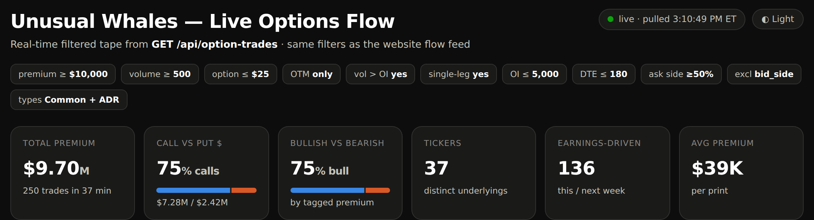
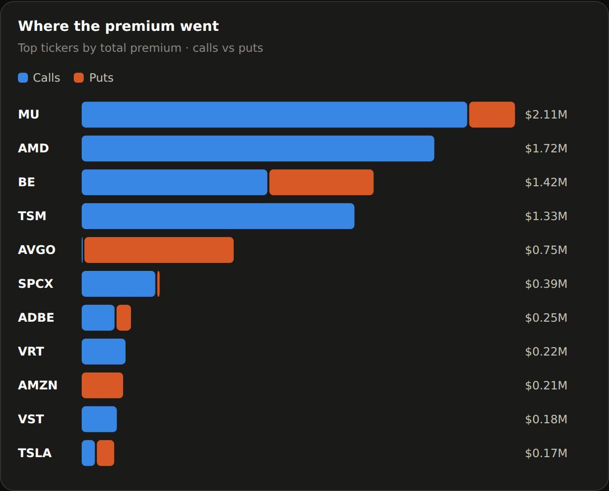
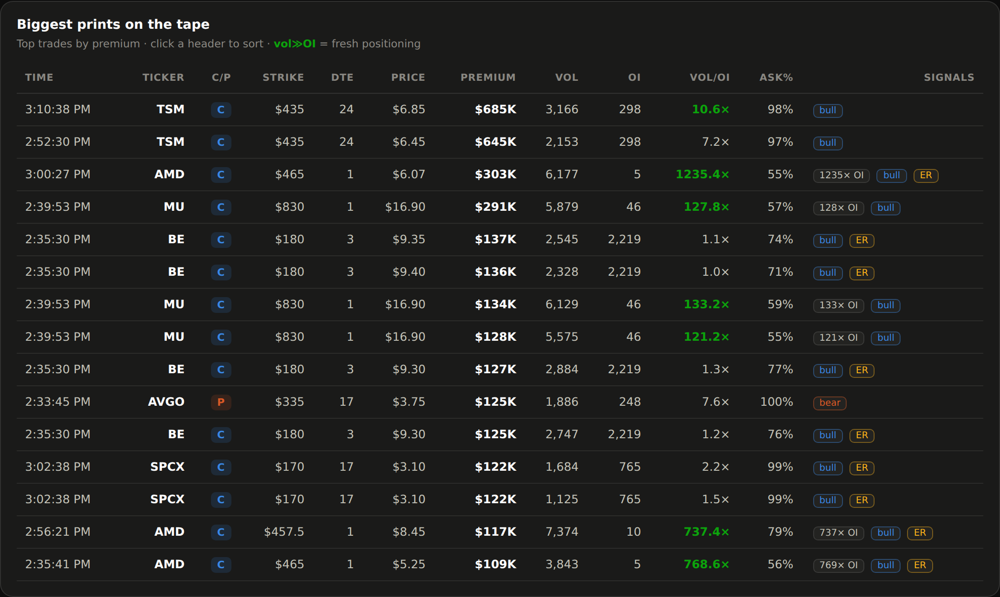

# UW Live Options Flow

A self-contained dashboard for the Unusual Whales live options-flow endpoint
(`GET /api/option-trades`). One Python script pulls the current trading day's
filtered flow — same filters as the website flow feed — and bakes it into a
single HTML file: premium charts, a sortable tape, hover tooltips, dark/light
toggle. No build tools, no dependencies, standard library only.

**Live demo:** https://sonofbaal.github.io/uw-live-options-flow/



## Quickstart

```bash
export UW_TOKEN="your_api_key"        # macOS / Linux  (Windows: set UW_TOKEN=your_api_key)
python3 build_dashboard.py            # pulls the flow, writes uw_flow_dashboard.html
open uw_flow_dashboard.html           # Linux: xdg-open, Windows: double-click
```

You need an Unusual Whales API key (any API plan) and Python 3.8+. Nothing to install.

## What it shows

One request, filtered server-side, becomes total premium, a call/put split,
bullish/bearish tagging, premium by ticker and sector, an intraday flow timeline,
a days-to-expiry breakdown, and a sortable tape of the biggest prints that flags
volume-far-above-open-interest as fresh positioning.





## Customize the screen

The `FILTERS` block at the top of `build_dashboard.py` maps 1:1 to the website
flow page. Change the premium floor, price cap, DTE, add a `ticker_symbol`, then
re-run:

```python
FILTERS = {
    "is_otm": "true",
    "volume_greater_oi": "true",
    "min_premium": 10000,
    "max_price": 25,
    "min_ask_perc": 0.5,
    # ...
    "limit": 250,
}
```

The endpoint serves the **latest trading day only**. For historical days, download
the full tape from `GET /api/option-trades/full-tape/{date}` and filter client side.

## Files

| File | What it is |
|------|------------|
| `build_dashboard.py` | Fetches the flow and builds the dashboard. Standard library only. |
| `uw_flow_dashboard_template.html` | The dashboard shell the script fills with data. |
| `index.html` | A pre-built snapshot — this is what the live demo serves. |

## Notes

- No key is stored in this repo, and `.gitignore` blocks `.env` / `UW_TOKEN` so you
  don't commit one by accident.
- The generated `uw_flow_dashboard.html` is fully self-contained: no server, no
  external calls, safe to host as a static file.

## License

MIT — see [LICENSE](LICENSE).

---

Built on the [Unusual Whales API](https://api.unusualwhales.com/docs). Live options
flow endpoint by Serhii (greyblake) and Nico.
